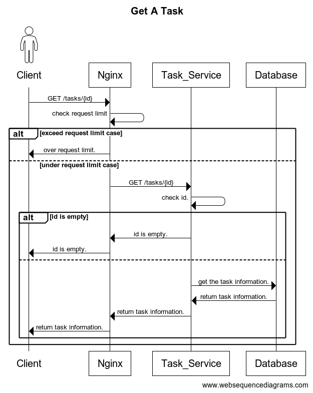
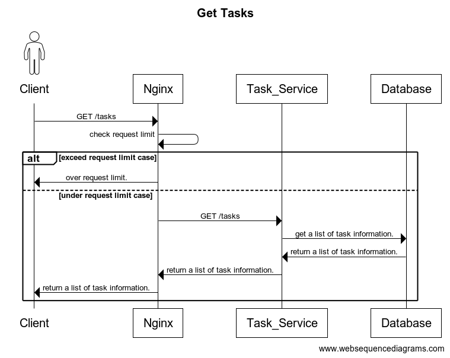
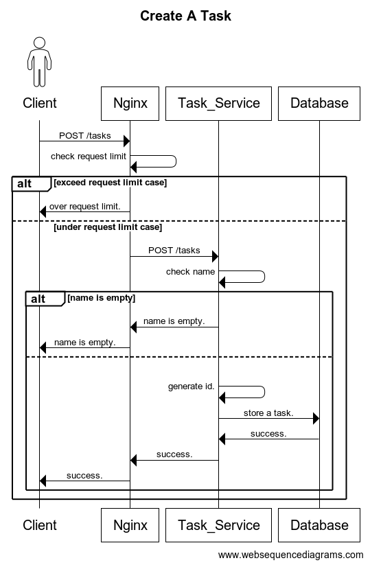
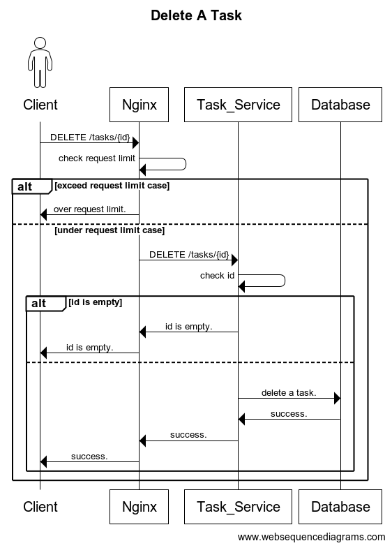
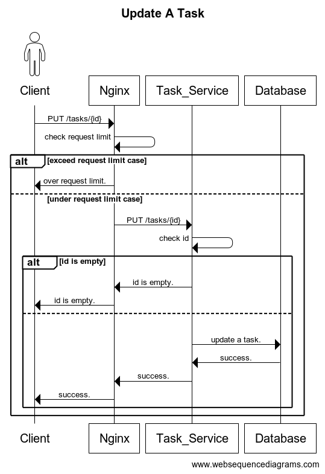

# Task Service

## About it
- This is a repository about task service. Here is the [API document](./protos/task/v1/task_service.swagger.json).

## Components
- I use the following components to build the task service.
  - Rate limiter (Nginx)
  - Load balance (Nginx)
  - Database (Redis)
- I don't have a sequencer component because the task service can generate the sequence by itself with the Snowflake algorithm.
### Why use the Snowflake algorithm
- The task service needs to generate a unique ID to track the task. If it is a single server, we only need to simply use UUID. However, now facing a large number of customers, I wanted to design a distributed system, so I used the Snowflake algorithm. Still, the physical clocks are unreliable. Sequences generated from different nodes may not maintain order. If we want to keep the sequence order, using the TrueTime API provided by Google might be a good choice.

## How to run it
1. `make gen-images`
   - This will generate a task-service image.
2. `make service-up`
   - This will start running all the components.
- The Nginx will use `port 8080`

## Unit Test
- `make test-go`
  - This will show the testing coverage.

## Flow
### Get a task

### Get tasks

### Create a task

### Delete a task

### Update a task

## Questions
1. Does the task need TTL?
   - It depends on the requirements, but usually yes, we need to copy the long-ago data from the in-memory database to other persistent databases such as S3, and delete it from the in-memory database to release storage.
2. Does Redis need to use cluster deployment?
   - If we consider the high availability and scalability, we need to deploy the Redis with clusters.
3. Are the tasks causally related?
   - If yes, we need some data fields to record it.